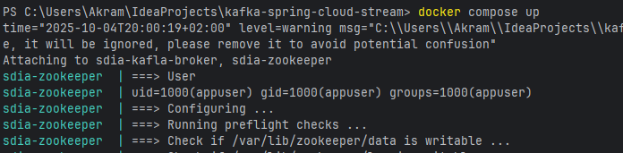
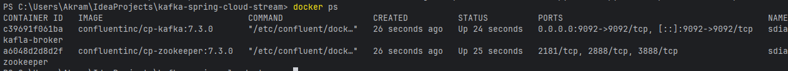
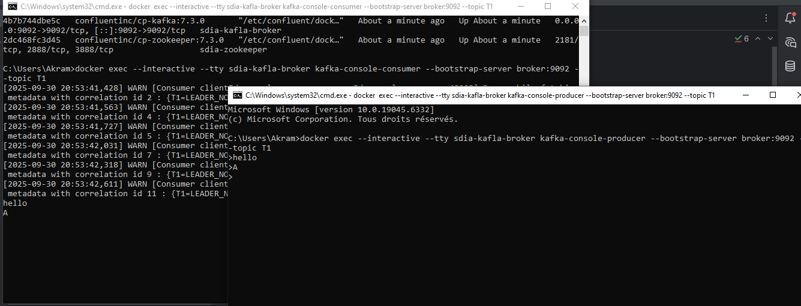
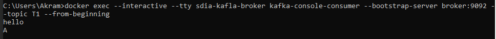
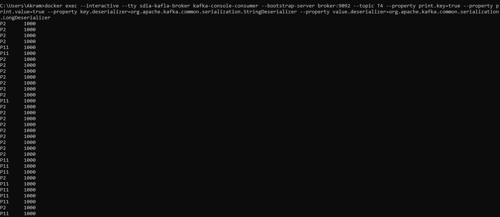
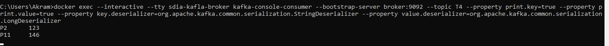
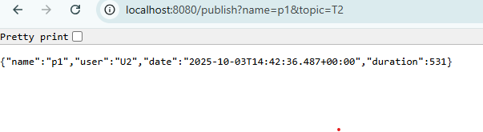
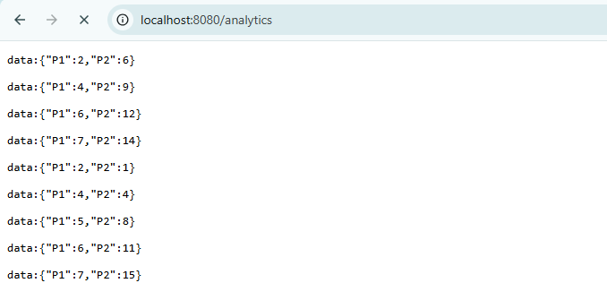
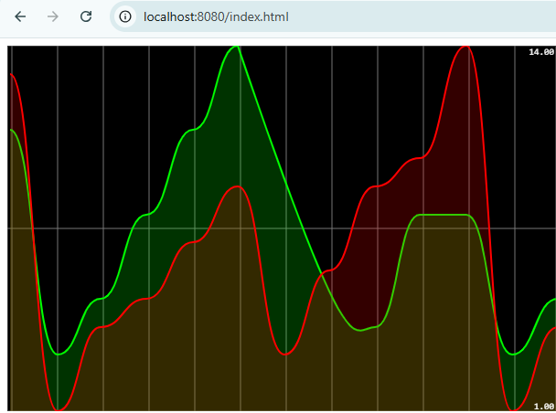

# TP1 : Event Driven Architecture avec KAFKA

Ce TP démontre un système d'analyse en temps réel utilisant Spring Cloud Stream avec Apache Kafka. Elle traite les événements de pages en temps réel et affiche les analyses via une interface web.

## Aperçu de l'architecture

Cette application implémente un pipeline complet de diffusion d'événements :
1. **Producteur d'événements** : Génère des événements de page et les envoie aux Topic
2. **Consommateur d'événements** : Traite les événements entrants et les journalise
3. **Processeur de flux** : Utilise Kafka Streams pour traiter les événements en temps réel
4. **Requête interactive** : Fournit des analyses en temps réel via une API REST
5. **Interface utilisateur web** : Affiche les analyses en temps réel en utilisant SmoothieCharts


## Structure du projet

```
src/
├── main/
│   ├── java/
│   │   └── com/proj/kafkaspringcloudstream/
│   │       ├── controllers/        # Contrôleurs REST
│   │       ├── events/             # Modèles d'événements
│   │       ├── handlers/           # Processeurs de flux
│   │       └── KafkaSpringCloudStreamApplication.java
│   └── resources/
│       ├── static/                 # Fichiers de l'interface utilisateur
        └── application.properties  # Configuration

```

## Prérequis

- Java 17 ou supérieur
- Maven 3.6+
- Docker et Docker Compose
- IDE (IntelliJ IDEA recommandé)

## Configuration et installation

1. Cloner le dépôt :
   ```bash
   git clone <url-du-dépôt>
   cd kafka-spring-cloud-stream
   ```

2. Démarrer Kafka et Zookeeper en utilisant Docker Compose :
   ```bash
   docker-compose up -d
   ```
   ![Démarrage de Docker Compose - Ajouter une capture d'écran ici]

3. Construire le projet :
   ```bash
   mvn clean install
   ```

## Exécution de l'application

Exécuter l'application Spring Boot :
```bash
mvn spring-boot:run
```

Ou exécuter le fichier JAR :
```bash
java -jar target/kafka-spring-cloud-stream-0.0.1-SNAPSHOT.jar
```

## Configuration Docker Compose

L'application utilise Docker Compose pour configurer et exécuter les services Kafka et Zookeeper nécessaires.

### Fichier compose.yml

Le fichier [compose.yml](compose.yml) définit deux services :

```
version: '3'
services:
  zookeeper:
    image: confluentinc/cp-zookeeper:7.3.0
    container_name: sdia-zookeeper
    environment:
      ZOOKEEPER_CLIENT_PORT: 2181
      ZOOKEEPER_TICK_TIME: 2000

  broker:
    image: confluentinc/cp-kafka:7.3.0
    container_name: sdia-kafla-broker
    ports:
      - "9092:9092"
    depends_on:
      - zookeeper
    environment:
      KAFKA_BROKER_ID: 1
      KAFKA_ZOOKEEPER_CONNECT: 'zookeeper:2181'
      KAFKA_LISTENER_SECURITY_PROTOCOL_MAP: PLAINTEXT:PLAINTEXT,PLAINTEXT_INTERNAL:PLAINTEXT
      KAFKA_ADVERTISED_LISTENERS: PLAINTEXT://localhost:9092,PLAINTEXT_INTERNAL://broker:29092
      KAFKA_OFFSETS_TOPIC_REPLICATION_FACTOR: 1
      KAFKA_TRANSACTION_STATE_LOG_MIN_ISR: 1
      KAFKA_TRANSACTION_STATE_LOG_REPLICATION_FACTOR: 1
```

### Démarrage des services avec Docker Compose

Pour démarrer les services Kafka et Zookeeper, exécutez la commande suivante depuis la racine du projet :

```bash
docker-compose up -d
```

Cette commande :
- Télécharge les images Docker nécessaires si elles ne sont pas déjà présentes
- Démarre les conteneurs Zookeeper et Kafka en arrière-plan
- Configure les services selon les paramètres définis dans le fichier compose.yml



### Vérification des services

Pour vérifier que les services sont correctement démarrés :

```bash
docker-compose ps
```



Vous devriez voir les deux conteneurs dans l'état "Up".

### Arrêt des services

Pour arrêter les services :

```bash
docker-compose down
```

## Production et consommation d'événements

Vous pouvez produire et consommer des événements directement à l'aide des commandes Kafka suivantes :

### Consommer des événements depuis le topic T1
```bash
docker exec --interactive --tty sdia-kafla-broker kafka-console-consumer --bootstrap-server broker:9092 --topic T1
```

### Produire des événements vers le topic T1
```bash
docker exec --interactive --tty sdia-kafla-broker kafka-console-producer --bootstrap-server broker:9092 --topic T1
```



### consomer des événements vers le topic T1 depuis le debut
```bash
docker exec --interactive --tty sdia-kafla-broker kafka-console-consumer --bootstrap-server broker:9092 --topic T1 --from-beginning
```


### Consommer les résultats agrégés depuis le topic T4
```bash
docker exec --interactive --tty sdia-kafla-broker kafka-console-consumer --bootstrap-server broker:9092 --topic T4 --property print.key=true --property print.value=true --property key.deserializer=org.apache.kafka.common.serialization.StringDeserializer --property value.deserializer=org.apache.kafka.common.serialization.LongDeserializer
```



## Génération continue d'événements

L'application génère automatiquement des événements de page en continu via le composant [PageEventSupplier](src/main/java/com/proj/kafkaspringcloudstream/handlers/PageEventHandler.java) qui publie des événements toutes les 200ms vers le topic `T3`.

## Transformation de flux d'événements

L'application transforme un flux d'événements en un autre à l'aide de Kafka Streams :
1. Les événements de page sont consommés depuis le topic `T3`
2. Ils sont transformés et agrégés dans des fenêtres de 5 secondes
3. Les résultats sont produits vers le topic `T4` avec le comptage des vues par page




## Points de terminaison API

### Publier des événements de page
```
GET /publish?name={nomDeLaPage}&topic={nomDuTopic}
```
Publie un événement de page vers le sujet Kafka spécifié.

Exemple :
```
GET http://localhost:8080/publish?name=p1&topic=T2
```


### Analyse en temps réel
```
GET /analytics
```
Point de terminaison Server-Sent Events (SSE) qui fournit des données d'analyse en temps réel.

Exemple :
```
GET http://localhost:8080/analytics
```


## Tableau de bord d'analyse en temps réel

L'application inclut un tableau de bord basé sur le web pour visualiser les analyses en temps réel :

```
http://localhost:8080/
```
Le tableau de bord affiche les comptages de vues de page en temps réel en utilisant SmoothieCharts.js.


## Fonctionnement

1. **Génération d'événements** : Le bean [PageEventSupplier](src/main/java/com/proj/kafkaspringcloudstream/handlers/PageEventHandler.java) génère des événements de page aléatoires toutes les 200ms et les envoie au sujet `T3`.

2. **Consommation d'événements** : Le bean [PageEventConsumer](src/main/java/com/proj/kafkaspringcloudstream/handlers/PageEventHandler.java) consomme les événements du sujet `T2` et les journalise dans la console.

3. **Traitement de flux** : Le [KStreamFunction](src/main/java/com/proj/kafkaspringcloudstream/handlers/PageEventHandler.java) traite les événements du sujet `T3`, compte les vues de page dans des fenêtres de 5 secondes, et envoie les résultats au sujet `T4`.

4. **Requêtes interactives** : Le [PageEventController](src/main/java/com/proj/kafkaspringcloudstream/controllers/PageEventController.java) expose le point de terminaison `/analytics` qui fournit un accès en temps réel au magasin fenêtré.

5. **Interface utilisateur web** : Le fichier [index.html](src/main/resources/static/index.html) utilise Server-Sent Events pour consommer les données d'analyse et les visualiser avec SmoothieCharts.

## Configuration

Configurations principales dans [application.properties](src/main/resources/application.properties) :

```properties
# Nom de l'application
spring.application.name=kafka-spring-cloud-stream

# Port du serveur
server.port=8080

# Liaisons des sujets Kafka
spring.cloud.stream.bindings.pageEventConsumer-in-0.destination=T2
spring.cloud.stream.bindings.pageEventSupplier-out-0.destination=T3
spring.cloud.stream.bindings.KStreamFunction-in-0.destination=T3
spring.cloud.stream.bindings.KStreamFunction-out-0.destination=T4

# Intervalle d'interrogation pour le fournisseur d'événements
spring.cloud.stream.bindings.pageEventSupplier-out-0.producer.poller.fixed-delay=200

# Définitions de fonctions
spring.cloud.function.definition=pageEventConsumer;pageEventSupplier;KStreamFunction
```

## Développement

### Construction du projet
```
mvn clean install
```

### Exécution des tests
```bash
mvn test
```
